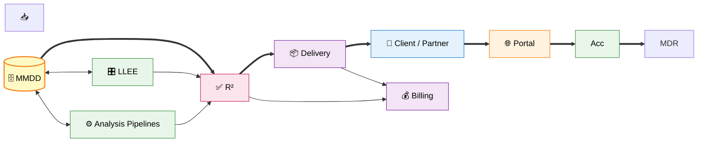

# This is a test

> we have a markdown file...

---

# We have a mermaid diagram

```mermaid
flowchart LR
  Client["👤 Client / Partner"]
  Portal["🌐 Portal"]
  Marina["📥 "]
  MMDD[("🗄️ MMDD")]
  LLEE["🎛️ LLEE"]
  Daylily["⚙️ Analysis Pipelines"]
  R2["✅ R²"]
  Delivery["📦 Delivery"]
  Billing["💰 Billing"]

  Client ==> Portal ==> Acc ==> MDR
  MMDD <--> LLEE
  MMDD <--> Daylily
  MMDD ==> R2
  LLEE --> R2
  Daylily --> R2
  R2 ==> Delivery ==> Client
  Delivery --> Billing
  R2 --> Billing

  classDef clientStyle fill:#e3f2fd,stroke:#1976d2,stroke-width:1px,color:#000
  classDef portalStyle fill:#fff3e0,stroke:#f57c00,stroke-width:1px,color:#000
  classDef mdrStyle fill:#fff9c4,stroke:#f57f17,stroke-width:2px,color:#000
  classDef execStyle fill:#e8f5e9,stroke:#388e3c,stroke-width:1px,color:#000
  classDef assessStyle fill:#fce4ec,stroke:#c2185b,stroke-width:1px,color:#000
  classDef deliveryStyle fill:#f3e5f5,stroke:#7b1fa2,stroke-width:1px,color:#000

  class Client clientStyle
  class Portal portalStyle
  class Acc,LLEE,Daylily execStyle
  class MMDD mdrStyle
  class R2 assessStyle
  class Delivery,Billing deliveryStyle
```

# And

- that
- is
- that